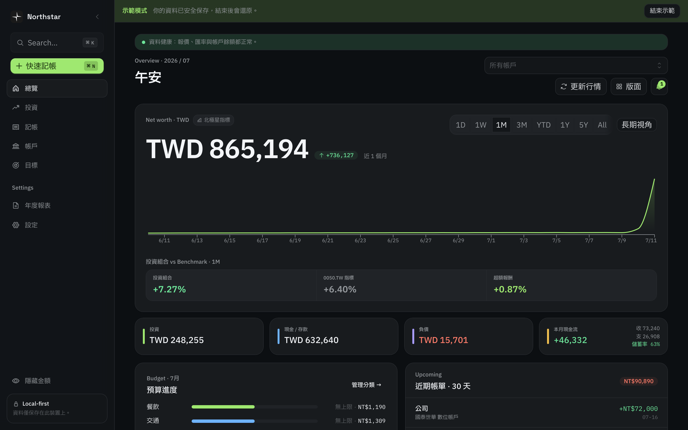
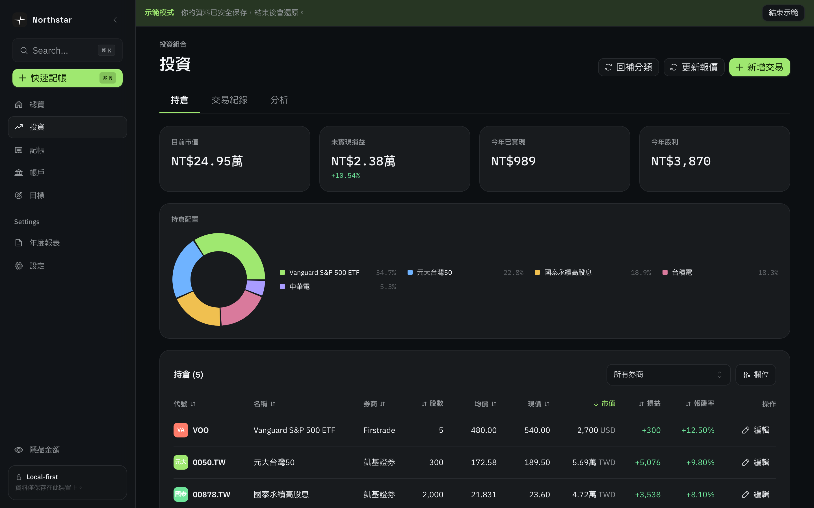
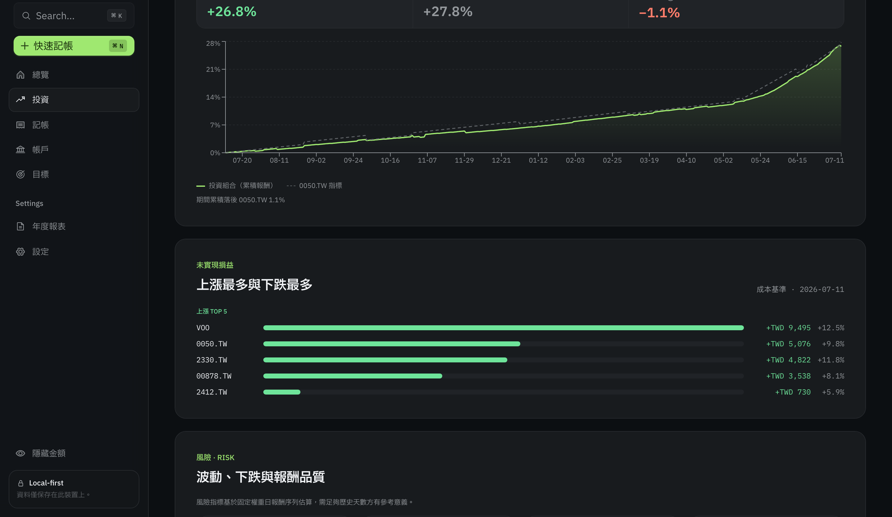
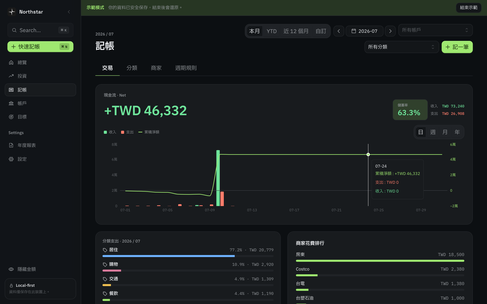

# Northstar

**繁體中文** · [English](README.en.md)

[](https://github.com/larryjclai/northstar/releases/latest)
[](https://github.com/larryjclai/northstar/actions/workflows/ci.yml)
[](LICENSE)
[](https://github.com/larryjclai/northstar/releases)


> **Beta 版** · 核心功能已可日常使用，介面與新功能仍會演進。
> **你既有的本機資料一定開得起來**——自 Beta 起資料庫 migration 只增不減，升級不需重建資料。
> 最新版本請見 **[Releases 頁面](https://github.com/larryjclai/northstar/releases)**。

**讓你了解自己的開支，陪你一起累積資產。**

Northstar 是一個 local-first、隱私優先的個人與家庭財務 App。它把**流水帳**（你的開支）和**股票帳**（你的投資）合在一起，讓你看到完整的**資產**全貌——資料全部存在你自己的電腦裡，但保有匯出 JSON, CSV 的自由彈性。

Northstar 想要讓達成的目標：
- **了解自己的儲蓄率** — 日常記帳，知道每個月實際存下多少。
- **跟大盤比較你的投資績效**  — 記錄投資交易、與你選的 Benchmark（如 0050）比較。如果長期贏不了大盤，那就加入大盤吧！
- **看清離目標還有多遠** — 設定目標與 FIRE 計算機，跟著你的淨值重算，告訴你距離你的目標還有多遠。

## 畫面預覽

以下為內建**示範模式**（載入示範資料，不影響你的真實資料）的畫面：



| 投資組合 | 績效分析 | 收支記帳 |
|---|---|---|
|  |  |  |

## 功能總覽

**資產與淨值**
- 多帳戶（銀行 / 現金 / 信用卡 / 貸款 / 投資 / 實體資產），多幣別，依交易當日匯率換算。
- 淨值採對帳式拆解：**資產 − 負債 = 淨值** 恆等。主淨值為現金基礎，另列「調整後淨值（含應收應付）」。
- 淨值趨勢線涵蓋歷史投資部位（以當期成本回推），非僅現金。

**流水帳與儲蓄率**
- 收支記帳、轉帳、週期性收支自動入帳。
- **⌘N 快速記帳**：用自然語言一句話記下支出 / 收入 / 投資買賣。
- 分期付款、退款沖銷、應收 / 應付（含代墊）、商家自動分類。
- 信用卡依結帳日切分帳單週期，區分本期消費與淨額（退款後）。
- 現金流圖表（收入 / 支出對照 + 累積淨額），可切日 / 週 / 月 / 年；儲蓄率追蹤。

**帳本與商用（公司帳）**
- **帳本分離**：把公司與個人的收入、支出、帳戶分成不同帳本，側欄切換器可切「個人帳」「公司帳」或**總帳**（合併檢視）。一般畫面隨切換器範圍化；FIRE / 退休 / 目標指標永遠只計個人帳，不受切換器影響。
- 每本帳可獨立設定「**計入個人淨值**」「**計入 FIRE 指標**」（個人帳預設開、公司帳預設關），公司資產不會灌進你的退休數字。
- **開發票 + 營業稅**：公司帳記帳可「開發票」，自動計算 5% 銷項營業稅（含稅 / 未稅換算）、支援台灣**統一發票字軌**與自動流水號；發票開出後於「未結清」追蹤，對方匯款即結清。
- **客戶主檔**（統編、預設收款條件、自動完成）、**帳齡分析**（未到期 / 逾期 30 / 60 / 90 天）、**平均收款週期（DSO）**、**雙月 401 銷項稅額彙總**（供報稅參考）。

**投資組合與分析**
- 全程**移動平均成本**；買賣含手續費。完整交易類型：買 / 賣 / 現金股利 / 股票股利 / 拆股 / 減資。
- **三種報酬口徑並列**：TWR（時間加權）、XIRR（資金加權年化）、期間價格報酬。
- 個股貢獻分析、股利與殖利率、幣別曝險、風險指標（波動、Sharpe、Sortino、最大回撤）、配置漂移。
- **與 Benchmark 對比 + Alpha**，持倉線圖標出買 / 賣點。
- 報價與匯率透過 Yahoo Finance。

**目標與 FIRE**
- 退休投影含通膨、費用、累積期 / 退休後報酬，實質 / 名目雙模式。
- **三情境（悲觀 / 中性 / 樂觀）成功穩健度**、Coast / Lean / Regular / Fat FIRE 試算。
- 退休收入項（勞保 / 年金 / 被動收入），可逐項設定是否隨通膨調整。

**隱私與資料**
- **Local-first**：資料存在本機 SQLite，不儲存在雲端。
- 選用的多裝置同步採**端對端加密**（你的資料在離開裝置前就已加密，伺服器看不到內容）。
- 隱私遮罩、深 / 淺 / 跟隨系統主題、繁體中文介面。

## 下載與安裝

前往 **[Releases 頁面](https://github.com/larryjclai/northstar/releases)** 下載最新安裝檔：

- **macOS**（Apple Silicon / Intel）：下載 `.dmg`，開啟後拖曳至「應用程式」。首次開啟請見下方說明。
- **Windows**：下載 `x64-setup.exe` 安裝程式。首次執行 SmartScreen 可能顯示「未知發行者」，點「其他資訊 → 仍要執行」即可。
- **Linux**：下載 `.deb`（Debian / Ubuntu 系）。

App 內建自動更新，有新版會主動提示。

### macOS 首次開啟

Northstar 尚未經過 Apple 公證（需付費的 Apple Developer 帳號），所以 macOS 第一次開啟會被 Gatekeeper 攔下。擇一即可：

- **顯示「無法驗證開發者」**：到「系統設定 → 隱私權與安全性」，往下找到 Northstar 被阻擋的訊息，按「**強制開啟**」。
  > macOS 15 (Sequoia) 起已移除舊版「右鍵 → 開啟」的繞過方式，請改用「強制開啟」。

- **顯示「已損毀，應移到垃圾桶」（常見於 AirDrop 傳送）**：開啟「終端機」執行下列指令移除隔離屬性，再正常開啟：
  ```bash
  xattr -dr com.apple.quarantine /Applications/Northstar.app
  ```

> 💡 建議更新透過 App 內自動更新或從 Releases 頁面下載 `.dmg` 安裝，而非用 AirDrop 傳 `.app`——AirDrop 較容易觸發「已損毀」。

## 目前是 Beta，請注意

- **資料相容性**：自 `0.2.0-beta.1` 起，資料庫 migration **只增不減**——只會新增欄位／資料表／索引，不會刪除或改寫既有欄位。升級版本不需重建資料。（仍建議定期用內建的「匯出備份」，這是通則，不是因為預期會壞。）
- 介面與新功能仍在演進，設定與版面可能隨版本調整。
- 匯率 / 報價透過 Yahoo Finance 公開 API，偶爾可能短暫被限流。
- 尚未做應用程式簽章 / 公證：macOS 首次開啟需手動放行；Windows 會跳 SmartScreen「未知發行者」警告。
- **主力測試平台為 macOS（Apple Silicon）**；Windows / Linux 為程式碼層級相容，尚未經過完整實機驗證。

## 回報問題與許願

歡迎開 [GitHub Issue](https://github.com/larryjclai/northstar/issues) 回報 bug 或許願功能，附上：

- 作業系統與版本
- 重現步驟、預期行為、實際行為
- 如與資料有關，附上你看到的錯誤訊息

也很歡迎直接和我分享使用心得——你的回饋會直接影響 Northstar 的方向。

## 授權與貢獻狀態

**Copyright © 2026 賴瑞晟 LAI Jui Cheng.** Northstar 的**原始碼**採 **[GNU GPL v3.0（或更新版本）](LICENSE)**。GPLv3 僅涵蓋本 repo 的程式碼，不涵蓋：

- **銀行 / 品牌 logo**（第三方商標）——存放於 gitignore 的 `private-assets/`，**不**包含在公開 repo 內；沒有它們也能正常建置。
- **內建字型**（Space Grotesk、IBM Plex Sans / Mono / Sans TC）——採 **SIL OFL-1.1**，與 GPLv3 相容但屬獨立授權。細節見 [THIRD-PARTY-LICENSES.md](THIRD-PARTY-LICENSES.md)。

> ⚠️ Northstar 不構成投資 / 理財建議。如 GPLv3 條款所載，本軟體「按現狀」提供、不附任何擔保。

**送 PR 須簽署 CLA**：所有 pull request 都需先簽署[貢獻者授權協議（CLA.md）](CLA.md)——一次性，由機器人在 PR 留言引導。詳見 [CONTRIBUTING.md](CONTRIBUTING.md)。若要回報資安問題，請看 [SECURITY.md](SECURITY.md)，不要在公開 issue 內貼完整漏洞細節、token、個人財務資料或未遮蔽截圖。

## 想參與開發？

本機建置、測試與打包說明請見 **[開發文件](docs/DEVELOPMENT.md)**。

其他文件：
- [產品規格 Product spec](docs/product-spec.md)
- [架構 Architecture](docs/architecture.md)
- [Roadmap](ROADMAP.md)
